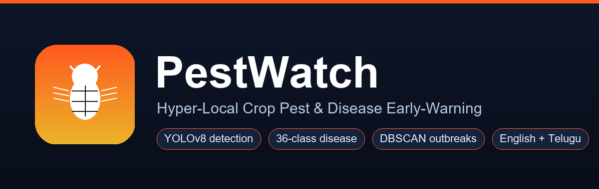
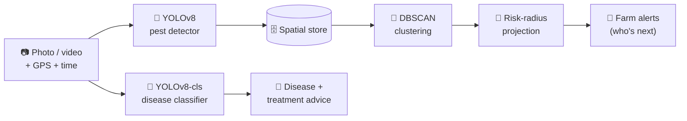
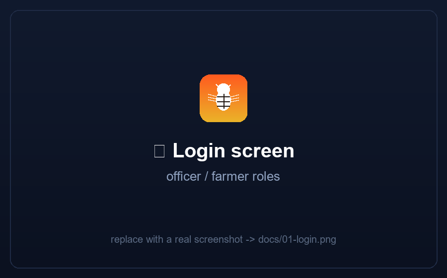
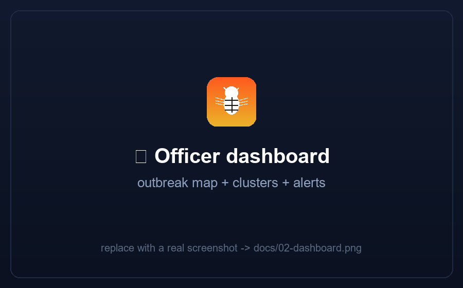
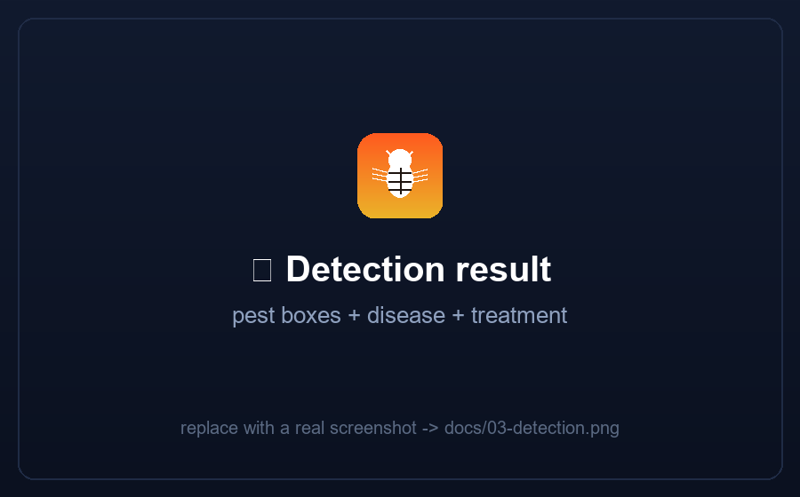
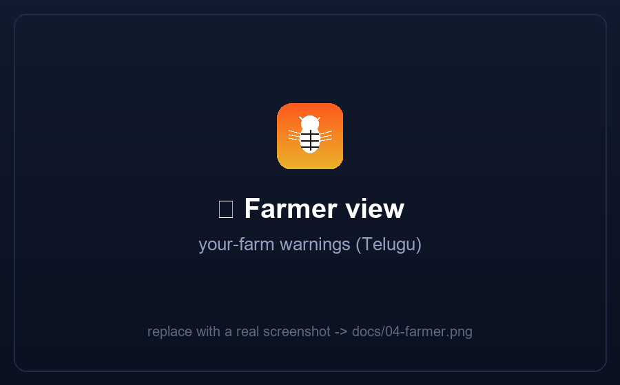

# 🐛 PestWatch — Hyper-Local Crop Pest & Disease Early-Warning

> One farmer's photo helps one farmer. **PestWatch turns a hundred photos into a
> district-level outbreak warning** — and sends it to the farms standing in the
> pest's path, while there's still time to act.

**🌐 Live app → https://pestwatch-nemy.onrender.com**  
Log in with a demo account: **`officer` / `officer123`** (dashboard) or
**`farmer` / `farmer123`** (reporter).  
*(Free host — the first visit after it's been idle can take ~50 s to wake up, then it's fast.)*


*Team **Ctrl Freaks** · LaunchPad X · Computer Vision track*

---

## The problem

A pest arrives in one corner of one field. Nobody sees it until it's a third of
the crop — and by then it has already spread to the farms 3 km away, who will
discover it the same way: too late. Pest **identification** is a solved problem;
**coordination** is not. PestWatch builds the missing layer that connects one
farmer's discovery to the farmers in the path of the spread.

## What it does

Upload a crop photo (or video). PestWatch runs **two real vision models** and
feeds an outbreak-intelligence layer:



- **Layer 1 — Vision (the solved part):** a trained **YOLOv8** detector finds
  insect pests (boxes, species, confidence, counts) and a trained **YOLOv8
  classification** model spots leaf disease across **36 classes / 14 crops**.
- **Layer 2 — Intelligence (what makes it ours):** every geo-tagged report is
  pooled; **DBSCAN** finds outbreak clusters; a **risk radius** is projected
  (species dispersal × cluster intensity × recency); and registered farms inside
  that radius get a concrete alert — *what pest, how far, which direction, how
  urgent, and what to do.*

## Screenshots

<!-- Replace the placeholder images in docs/ with real screenshots (same filenames). -->
| | |
|:--:|:--:|
|  |  |
|  |  |

## Features

| | |
|---|---|
| 🐛 **Pest detection** | Trained YOLOv8 — bounding boxes, species, confidence, counts |
| 🦠 **Disease detection** | Trained YOLOv8-cls — 36 classes across 14 crops, with treatment advice |
| 🗺️ **Live outbreak map** | Reports, DBSCAN clusters, risk rings, at-risk farms (Leaflet) |
| 📣 **Early-warning alerts** | Distance, direction, lead-time, inspection tip, control measure |
| 👨‍💼🧑‍🌾 **Two roles** | Officer (district dashboard + manage) · Farmer (report + your-farm warnings) |
| 🎞️ **Photo *and* video input** | Video is sampled frame-by-frame and aggregated |
| 🇬🇧🇮🇳 **English + Telugu** | Entire UI **and** the AI advice are bilingual |
| 📲 **Installable** | PWA (Add to Home Screen) **and** a native Android APK |
| ☁️ **Deployed** | Dockerised, live on the cloud |

## Answering the stated CV challenge — "poor lighting & complex backgrounds"

`backend/augment.py` implements a training-time augmentation pipeline that
deliberately simulates field conditions — brightness/contrast jitter, gaussian &
motion blur, synthetic shadow injection, hue/saturation shift (green-on-green
camouflage), rotation/scale jitter, and mosaic background randomisation. We train
on ugly images so ugly images don't surprise the model.

## Tech stack

**Backend** FastAPI · **Vision** YOLOv8 / PyTorch (Ultralytics) · **Image** OpenCV
· **Clustering** scikit-learn (DBSCAN) · **Store** SQLite · **Map/UI** Leaflet +
vanilla JS · **Mobile** Capacitor (Android) + PWA · **Deploy** Docker → Render.

---

## Run it locally

```bash
pip install -r requirements.txt
python run.py
```

Open **http://localhost:8000**. A demo scenario (2 outbreaks, 6 farms near
Guntur, AP) is seeded automatically. Detector modes are auto-selected and shown
in the header badge: `yolo-custom` (trained model in `models/best.pt`) →
`yolo-base` → `simulated` fallback, so the app always runs.

### Verify all judging criteria
```bash
python verify_rubric.py      # prints a 12/12 pass report
```

## Train your own models (optional — already done once)

```bash
python prepare_dataset.py && python train.py            # pest detector  -> models/best.pt
python prepare_disease.py && python train_disease.py    # disease model  -> models/disease_best.pt
```

## Deploy to the cloud

Everything is prepared (`Dockerfile`, `requirements-deploy.txt`, `.dockerignore`).
See **[DEPLOY.md](DEPLOY.md)** — the live instance runs on Render from this repo's
Dockerfile. To rebuild the Android APK against your own URL, set `server.url` in
`capacitor.config.json` and run `build_apk.bat`.

## Project structure

```
backend/    app.py · detector.py · disease_classifier.py · clustering.py
            store.py · species.py · diseases.py · augment.py · auth.py · seed.py · geo.py
frontend/   index.html · app.js · i18n.js · styles.css · manifest.json · sw.js
android/    Capacitor Android project (build with build_apk.bat)
models/     best.pt (pest) · disease_best.pt (disease)
Dockerfile · DEPLOY.md · verify_rubric.py · run.py
```

## Judging rubric (Track 3 — Computer Vision)

| # | Criterion | How PestWatch meets it |
|---|---|---|
| 1 | Input Stream | Image **and** video |
| 2 | Vision Pipeline | Two real models: YOLOv8 detector + YOLOv8-cls classifier |
| 3 | Automated Understanding | Detection (pests) **+** classification (36 diseases) |
| 4 | Measurable Output | Boxes, labels, confidence, instance counts, disease labels |
| 5 | Technical Depth | 2 trained models + DBSCAN + risk projection + alerting + auth |
| 6 | Reliability | Bad input → 400, auth → 401, role-gating → 403, model fallbacks |
| 7 | Innovation | Layer-2 outbreak intelligence + dual pest/disease + bilingual |
| 8 | Impact | District early warning; fits the govt. agri-extension system |
| 9 | Demo | Live map, two-model results, role views, video, deployed |

## Honest limitations

- Cluster reliability scales with participation; sparse areas degrade to
  single-report identification.
- Spread projection is proximity-based (no wind/corridor modelling yet).
- The shipped models are compact hackathon checkpoints — accurate enough to
  demo, not production-grade; more data + epochs on a GPU improves them with the
  same scripts.
- It supports agronomic decisions; it does not replace an entomologist.

## License

MIT — see [LICENSE](LICENSE).
